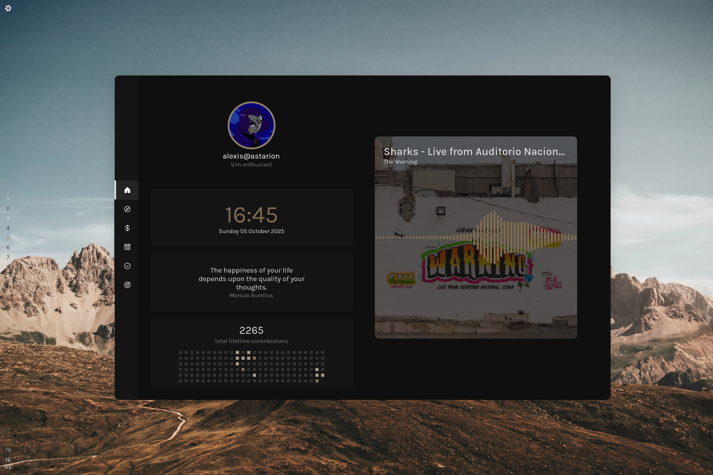
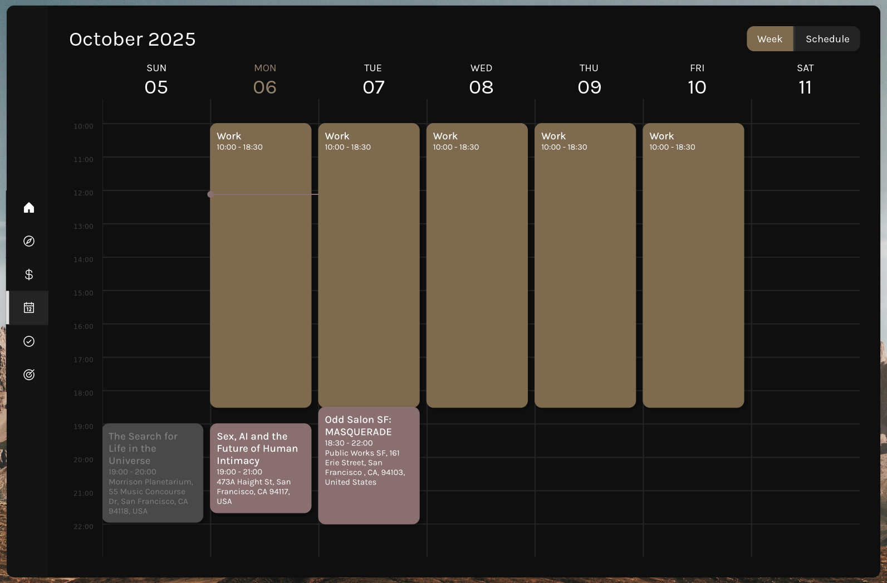
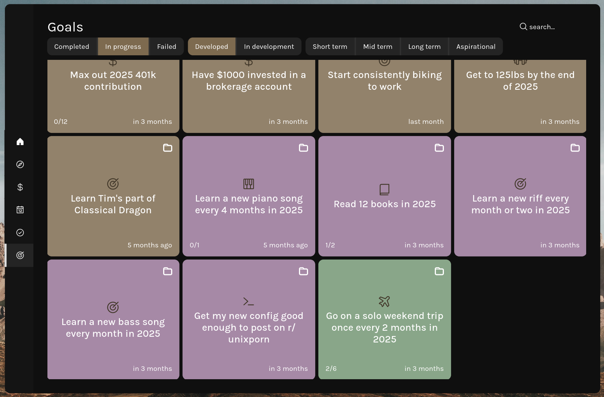
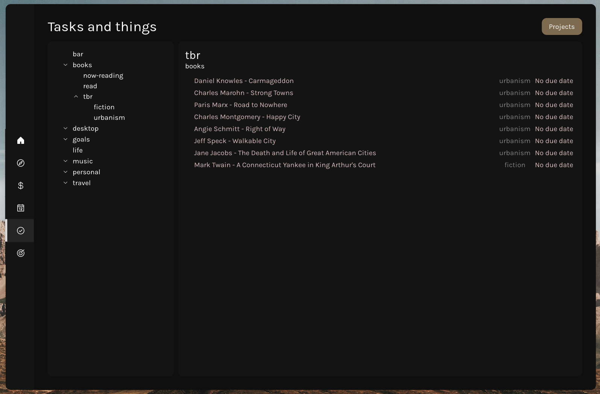
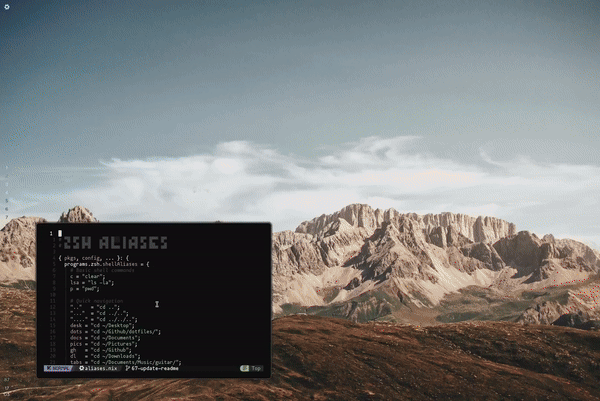
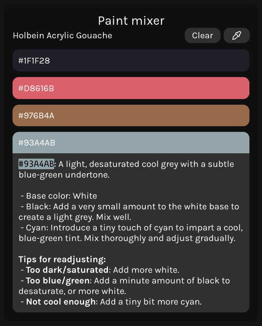
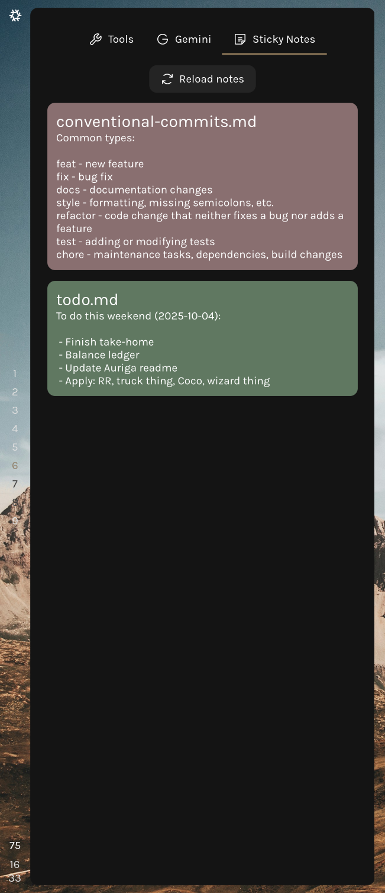
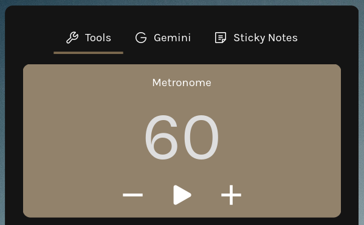

  <h1>Auriga</h1>
  
   
  Another desktop with an emphasis on functionality and cohesive design. Made
  with ❤️ and <a href="https://aylur.github.io/ags/" target="_blank">ags</a>.

<h2>What is it?</h2>

This repo contains my entire system configuration - all of my configs, my shell, etc. It is managed with NixOS.

  The included shell is the successor to previous config called <a href="https://github.com/garado/cozy" target="_blank">Cozy</a>.

<h2>Dashboard</h2>

<h3>Ledger</h3>

<!-- TODO: Screenshots! -->

A frontend for <a href="https://hledger.org/">hledger</a>, a plaintext accounting tool which I use to manage all of my finances.

The statistics tab displays balance tracking, debts/liabilities, recent spending analysis, and preview of recent transactions.

The analytics tab displays more detailed financial reports, such as spending by category by month.

The FIRE tab has an interactive plot showing current progress towards financial independence targets.

<h3>Calendar</h3>

Week view calendar with Google Calendar synchronization.

  

<h3>Goals tracking</h3>

Sort, filter, and search goals tracked in TaskWarrior.

  

<h3>Task tracking</h3>

View tasks stored in Taskwarrior.

  

<h3>Trip planning</h3>

A trip planning widget with multi-modal routing, route visualizations, and the option to send the trip details to my phone.

  Made because I use the <a href="https://transitapp.com/" target="_blank">Transit app</a> a lot, and after finding out they had an API, I wanted to play around with it. The widget uses: libshumate (map rendering), LocationIQ (location autocomplete), Pushover (sending trip details to phone), and of course the wonderful Transit API.

  

<h2>Control panel</h2>
<h3>Lots of convenient system controls</h3>

UI scaler (for different DPI monitors), power settings, wifi/Bluetooth/audio control, monitor arrangement and settings, and a few more things.

  

<h3>Theme switcher</h3>

Hot reloadable theme with shell, terminal, and wallpaper theme switching support.

  

</h3>

<h2>Utility panel</h2>

<h3>Paint mixer</h3>

  I like to paint (watercolor/gouache). I use this to help me match a specific
  color from a reference image. It supports multiple palettes and caches results
  so they're available next time I want to paint.

  <table>
    <tr>
      <td></td>
      <td></td>
    </tr>
  </table>

<h3>Sticky notes</h3>

Little notes-to-self.

  

<h3>Metronome</h3>

I play guitar. I made this metronome for when I feel like noodling around.

  

<h3>Gemini chat</h3>

For quick prompts to Gemini.

  

<h2>Acknowledgements</h2>

  
(People I have stolen from)

  <ul>
    <li><a href="https://github.com/end-4/dots-hyprland" target="_blank">end-4</a></li>
    <li><a href="https://github.com/kotontrion/dotfiles?tab=readme-ov-file" target="_blank">kotontrion</a></li>
    <li><a href="https://github.com/Misterio77/nix-starter-configs" target="_blank">misterio77 minimal nix starter config</a></li>
    <li><a href="https://github.com/fufexan/dotfiles" target="_blank">fufexan</a></li>
    <li><a href="https://github.com/leowercase/dotfiles" target="_blank">leowercase</a></li>
    <li><a href="https://github.com/budimanjojo/dotfiles" target="_blank">budimanjojo</a></li>
  </ul>

